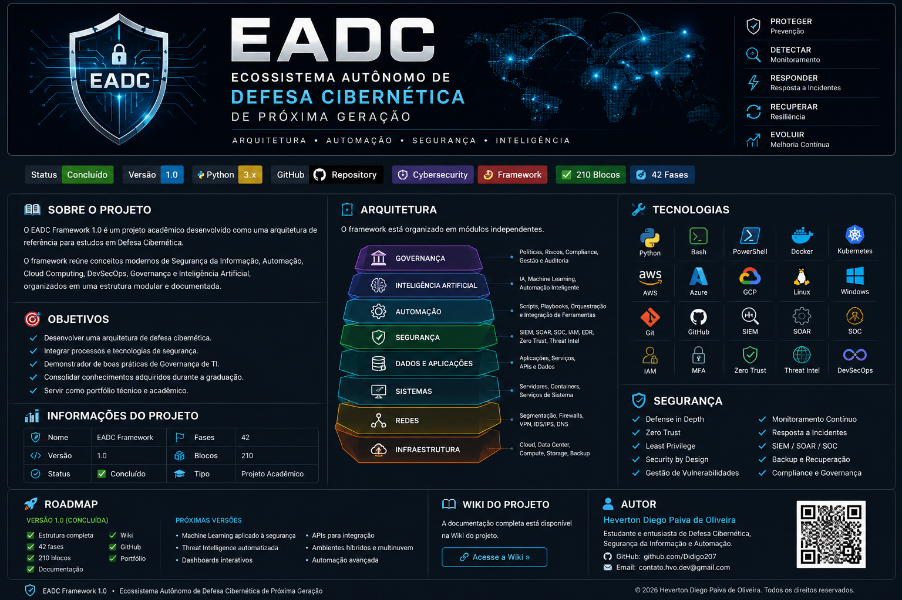

# 🛡️ EADC – Ecossistema Autônomo de Defesa Cibernética de Próxima Geração <p align="center">
  
</p>


---

# 📖 Sobre o Projeto

O **EADC Framework 1.0** é um projeto acadêmico desenvolvido como uma arquitetura de referência para estudos em Defesa Cibernética.

O framework reúne conceitos modernos de Segurança da Informação, Automação, Cloud Computing, DevSecOps, Governança e Inteligência Artificial, organizados em uma estrutura modular e documentada.

---

# 🎯 Objetivos

- Desenvolver uma arquitetura de defesa cibernética.
- Integrar processos e tecnologias de segurança.
- Demonstrar boas práticas de Governança de TI.
- Consolidar conhecimentos adquiridos durante a graduação.
- Servir como portfólio técnico e acadêmico.

---

# 📊 Informações do Projeto

| Item | Valor |
|-------|--------|
| Nome | EADC Framework |
| Versão | 1.0 |
| Status | ✅ Concluído |
| Fases | 42 |
| Blocos | 210 |
| Tipo | Projeto Acadêmico |

---

# 🏗️ Arquitetura

O framework está organizado em módulos independentes.

## Camadas

- Infraestrutura
- Redes
- Sistemas
- Aplicações
- Banco de Dados
- Segurança
- Automação
- Inteligência Artificial
- Governança

---

# 📂 Estrutura

```
docs/
arquitetura/
diagramas/
fases/
scripts/
imagens/
referencias/
portfolio/
```

---

# 🛡️ Tecnologias

- Python
- Bash
- PowerShell
- Docker
- Kubernetes
- Linux
- Windows Server
- AWS
- Azure
- Google Cloud
- Git
- GitHub
- DevSecOps
- SIEM
- SOAR
- SOC
- IAM
- MFA
- Zero Trust
- Threat Intelligence
- Threat Hunting
- Inteligência Artificial
