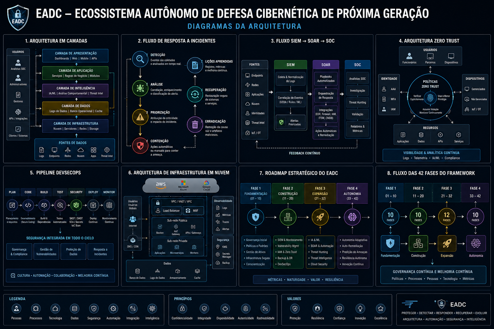

  

# 🛡️ EADC – Next Generation Autonomous Cyber Defense Ecosystem

---

## 📖 About the Project

**EADC Framework 1.0** is an academic cybersecurity architecture project designed as a reference framework for research and learning in modern cyber defense.

The framework integrates Information Security, DevSecOps, Cloud Computing, Artificial Intelligence, Governance, Automation, and Cyber Defense concepts into a structured architecture.

---

## 🎯 Objectives

- Design a modern cyber defense architecture.
- Integrate security technologies and operational processes.
- Demonstrate cybersecurity governance best practices.
- Consolidate knowledge acquired during undergraduate studies.
- Serve as a professional technical portfolio.

---

## 📊 Project Information

| Item | Value |
|------|-------|
| Project | EADC Framework |
| Version | 1.0 |
| Status | ✅ Completed |
| Phases | 42 |
| Blocks | 210 |
| Type | Academic Project |

---

## 🏗️ Architecture

  

The framework is organized into independent architecture layers.

### Layers

- Infrastructure
- Networks
- Systems
- Applications
- Databases
- Security
- Automation
- Artificial Intelligence
- Governance

---

## 🛠 Technologies

- Python
- Bash
- PowerShell
- Docker
- Kubernetes
- Linux
- Windows Server
- AWS
- Microsoft Azure
- Google Cloud
- Git
- GitHub
- DevSecOps
- SIEM
- SOAR
- SOC
- IAM
- MFA
- Zero Trust
- Threat Intelligence
- Threat Hunting

---

## 🔐 Security Features

- Defense in Depth
- Zero Trust
- Least Privilege
- Security by Design
- Continuous Monitoring
- Vulnerability Management
- Incident Response
- Backup and Disaster Recovery

---

## 🗺 Roadmap

### Version 1.0

- Complete architecture
- 42 phases
- 210 blocks
- Technical documentation
- GitHub repository
- Wiki

### Future Versions

- Machine Learning
- Predictive Security
- Autonomous Threat Intelligence
- Interactive Dashboards
- Hybrid Cloud Support
- API Integration

---

## 📚 Documentation

The complete documentation is available in the project Wiki.

---

## 📄 License

This project is intended for academic, educational, and professional portfolio purposes.

---

## 👨‍💻 Author

**Heverton Diego Paiva de Oliveira**

Areas of expertise demonstrated:

- Cyber Defense
- Information Security
- DevSecOps
- Cloud Security
- Security Architecture
- IT Governance
- Automation
- Artificial Intelligence

---

⭐ If you found this project useful, consider giving it a star on GitHub.

© 2026 Heverton Diego Paiva de Oliveira
